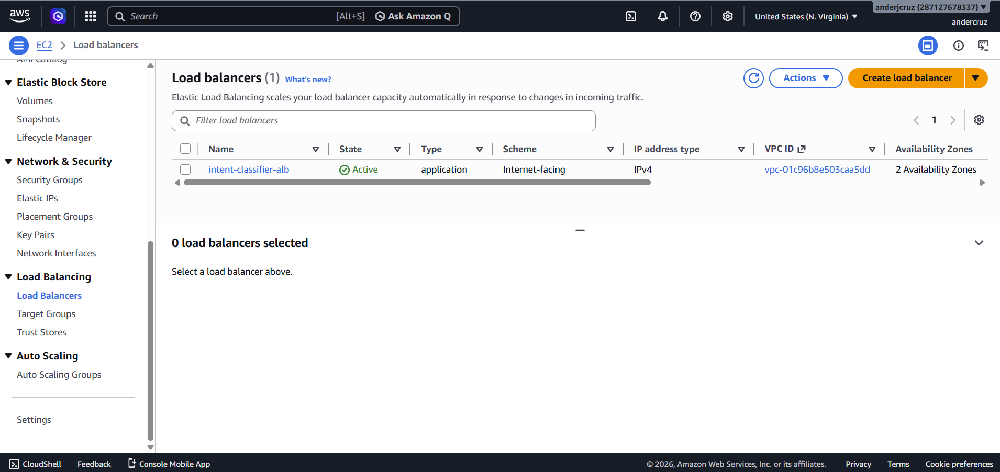
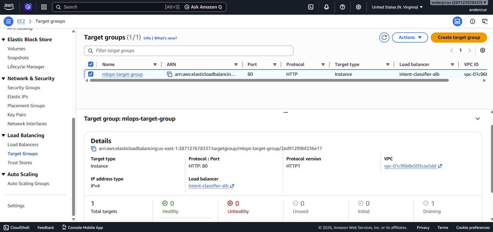
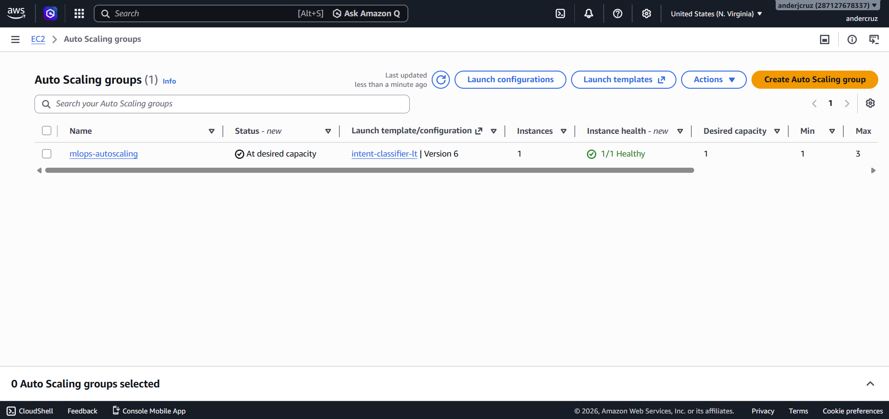

# Intent Classifier — AWS Production Deployment

Production-oriented deployment of a lightweight NLP intent-classification model on **Amazon Web Services (AWS)**.

This project demonstrates how a machine learning inference API can be transformed from a local Python application into a **high-availability, load-balanced and auto-scaled cloud service** using AWS infrastructure.

The architecture combines **Amazon EC2, Auto Scaling, Application Load Balancer, VPC networking, Nginx and Gunicorn** to provide a resilient inference endpoint.

---

## Project Overview

The project deploys an NLP intent-classification model as a Flask API and exposes it through an AWS Application Load Balancer.

The infrastructure is designed so that:

* application traffic enters through a single public endpoint;
* the load balancer distributes traffic across healthy EC2 instances;
* EC2 instances are managed by an Auto Scaling Group;
* new instances can be provisioned automatically;
* unhealthy instances can be replaced;
* Nginx acts as a reverse proxy;
* Gunicorn serves the Flask application;
* the machine learning application is automatically installed and configured during instance startup.

The architecture therefore moves beyond simple model serving into **production-oriented cloud deployment**.

---

## Architecture

```text
                            Internet
                               │
                               ▼
                    ┌─────────────────────┐
                    │ Application Load    │
                    │ Balancer (ALB)      │
                    │                     │
                    │ Internet-facing     │
                    │ HTTP :80            │
                    └──────────┬──────────┘
                               │
                               ▼
                    ┌─────────────────────┐
                    │ Target Group        │
                    │                     │
                    │ Health Checks       │
                    └──────────┬──────────┘
                               │
                ┌──────────────┴──────────────┐
                │                             │
                ▼                             ▼
      ┌─────────────────┐           ┌─────────────────┐
      │ EC2 Instance    │           │ EC2 Instance    │
      │                 │           │                 │
      │ Ubuntu          │           │ Ubuntu          │
      │                 │           │                 │
      │ Nginx :80       │           │ Nginx :80       │
      │      │          │           │      │          │
      │      ▼          │           │      ▼          │
      │ Gunicorn :6000  │           │ Gunicorn :6000  │
      │      │          │           │      │          │
      │      ▼          │           │      ▼          │
      │ Flask + ML      │           │ Flask + ML      │
      │ Model           │           │ Model           │
      └─────────────────┘           └─────────────────┘
                ▲                             ▲
                └──────── Auto Scaling ───────┘
```

The current architecture uses an Auto Scaling Group with a minimum of 1 instance, a desired capacity of 1 and a maximum of 3 instances. The instances are registered with the Target Group and receive traffic through the ALB.

---

# Why This Architecture?

A machine learning model running on a single EC2 instance creates a single point of failure.

This project introduces several production-oriented components:

### Application Load Balancer

The ALB provides a single public entry point and distributes requests across healthy instances.

### Target Group

The Target Group tracks the EC2 instances serving the application and performs health checks before routing traffic.

### Auto Scaling Group

The ASG manages the EC2 fleet and can maintain service availability by replacing unhealthy instances and scaling the number of instances within the configured limits.

### Nginx

Nginx acts as a reverse proxy between the public-facing network layer and the Python application server.

### Gunicorn

Gunicorn provides a production WSGI server for the Flask application.

### Infrastructure Automation

EC2 User Data automatically bootstraps new machines so that an instance can become an application server without manual configuration.

---

# Technology Stack

| Layer                     | Technology                               |
| ------------------------- | ---------------------------------------- |
| Cloud                     | AWS                                      |
| Compute                   | Amazon EC2                               |
| Instance type             | t3.micro                                 |
| Operating system          | Ubuntu 20.04                             |
| Load balancing            | Application Load Balancer                |
| Scaling                   | Auto Scaling Group                       |
| Networking                | VPC                                      |
| Subnets                   | Public subnets across Availability Zones |
| Internet access           | Internet Gateway                         |
| Security                  | Security Groups                          |
| Reverse proxy             | Nginx                                    |
| Application server        | Gunicorn                                 |
| API                       | Flask                                    |
| Machine Learning          | Python / scikit-learn                    |
| Infrastructure automation | AWS CLI                                  |
| Instance provisioning     | EC2 User Data                            |

The current implementation uses two public subnets across Availability Zones and an Internet Gateway for public connectivity.

---

# Repository Structure

```text
.
├── README.md
├── app.py
├── run.py
├── serve.py
├── wsgi.py
├── requirements.txt
├── model/
├── infrastructure/
│   ├── userdata.sh
│   └── setup.sh
├── docs/
│   └── deploy-guide.md
└── Screenshot/
    ├── ALB.png
    ├── target-group.png
    └── ASG.png
```

The repository separates the machine learning application from the AWS infrastructure and deployment documentation.

---

# Infrastructure Components

## 1. VPC and Networking

The deployment creates a dedicated VPC with public subnets distributed across multiple Availability Zones.

The networking layer includes:

```text
VPC
 │
 ├── Public Subnet — AZ A
 │
 ├── Public Subnet — AZ B
 │
 └── Internet Gateway
```

This provides the network foundation required for the public-facing load-balanced application.

---

## 2. Security Groups

The infrastructure uses AWS Security Groups to control inbound access.

The current configuration allows:

```text
HTTP :80
SSH  :22
```

HTTP is required for application traffic, while SSH is used for administration.

For a hardened production deployment, SSH access should ideally be restricted to a controlled administrative source or replaced with AWS Systems Manager.

---

## 3. EC2 Launch Template

The Launch Template defines the configuration of the application instances.

The current design uses:

```text
Ubuntu 20.04
t3.micro
EC2 Security Group
Bootstrap script
```

New instances execute the User Data script automatically during startup.

---

# Instance Bootstrap

The EC2 User Data script automates application installation.

The bootstrap workflow is approximately:

```text
EC2 Instance Launch
       │
       ▼
Install system dependencies
       │
       ▼
Clone application repository
       │
       ▼
Create Python virtual environment
       │
       ▼
Install Python dependencies
       │
       ▼
Train / prepare the model
       │
       ▼
Configure Gunicorn
       │
       ▼
Configure Nginx
       │
       ▼
Start application
```

This is particularly important for Auto Scaling because a newly launched EC2 instance must be able to configure itself without manual intervention.

---

# Auto Scaling

The deployment uses an Auto Scaling Group configured as:

```text
Minimum instances:   1
Desired instances:   1
Maximum instances:   3
```

The Auto Scaling Group provides two important capabilities:

### Self-healing

If an instance becomes unhealthy and is terminated, the ASG can launch a replacement instance.

### Elastic capacity

The infrastructure can scale the number of application instances within the configured limits.

This is an important architectural step toward highly available ML inference.

---

# Application Load Balancer

The ALB acts as the public entry point for the service.

Traffic flow:

```text
Client
  │
  ▼
ALB
  │
  ▼
Target Group
  │
  ├── EC2 Instance 1
  │
  ├── EC2 Instance 2
  │
  └── EC2 Instance 3
```

The Target Group performs health checks and allows the ALB to route traffic only to healthy targets.

---

# Application Layer

The underlying application remains intentionally simple.

The model is served through a Python API stack:

```text
Flask
  │
  ▼
Gunicorn
  │
  ▼
Nginx
  │
  ▼
Application Load Balancer
```

This creates a clean separation between:

* cloud networking;
* traffic management;
* reverse proxy;
* application server;
* machine learning inference.

---

# API Usage

Once the ALB is active and the Target Group reports healthy instances, the model can be accessed through the ALB DNS name.

Example:

```bash
curl -X POST http://<ALB-DNS-NAME> \
  -H "Content-Type: application/json" \
  -d '{"text":"book a flight to New York"}'
```

The application returns the predicted intent as the model inference response.

---

# Deployment

## Prerequisites

Install and configure:

* AWS CLI
* AWS credentials
* An existing EC2 Key Pair

Verify AWS CLI configuration:

```bash
aws configure
```

---

## Quick Deployment

Clone the repository:

```bash
git clone https://github.com/AnderCruz/MLOps-Intent-Classsfier-AWS-Production-Deployment.git
cd MLOps-Intent-Classsfier-AWS-Production-Deployment
```

Review the infrastructure configuration:

```bash
vim infrastructure/setup.sh
```

Run the infrastructure setup:

```bash
bash infrastructure/setup.sh
```

The full deployment process is documented in:

[`docs/deploy-guide.md`](docs/deploy-guide.md)

---

# Operational Verification

After deployment, several AWS CLI commands can be used to inspect the infrastructure.

## Check Auto Scaling Instances

```bash
aws autoscaling describe-auto-scaling-groups \
  --auto-scaling-group-name mlops-autoscaling \
  --region us-east-1 \
  --query "AutoScalingGroups[0].Instances"
```

## Check Target Health

```bash
aws elbv2 describe-target-health \
  --target-group-arn <TARGET_GROUP_ARN> \
  --region us-east-1
```

## Retrieve the ALB DNS Name

```bash
aws elbv2 describe-load-balancers \
  --names intent-classifier-alb \
  --region us-east-1 \
  --query "LoadBalancers[0].DNSName"
```

These commands provide basic operational visibility into instance health, load balancer targets and the public endpoint.

---

# Screenshots

The repository includes screenshots showing the deployed AWS infrastructure:

### Application Load Balancer



### Healthy Target Group



### Auto Scaling Group



These provide evidence of the infrastructure operating in AWS.

---

# MLOps Concepts Demonstrated

This project goes beyond model development and demonstrates several important production MLOps concepts.

### Model Serving

A machine learning model is exposed through a web API rather than being executed only in a notebook.

### Infrastructure Automation

Infrastructure creation and instance provisioning are automated through AWS CLI and EC2 User Data.

### Load Balancing

The ALB separates the public endpoint from the application instances.

### High Availability

Multiple Availability Zones and an Auto Scaling Group provide a foundation for resilient deployment.

### Self-Healing Infrastructure

The Auto Scaling Group can replace failed EC2 instances.

### Stateless Application Deployment

The application is packaged so that additional instances can be launched and configured using the same bootstrap process.

### Reverse Proxy Architecture

Nginx separates the public HTTP layer from the Python application server.

### Production WSGI Serving

Gunicorn provides the application-serving layer instead of using Flask's development server.

---

# Production Considerations

This repository demonstrates a production-oriented architecture, but there are several areas that would be required for a hardened production system.

## Security

Current SSH access should be restricted further.

Recommended improvements include:

* AWS Systems Manager instead of SSH
* private EC2 subnets
* NAT Gateway where required
* least-privilege IAM roles
* HTTPS with ACM certificates
* stricter security group rules
* AWS WAF

## Infrastructure as Code

The current infrastructure is provisioned using AWS CLI and shell scripts.

A natural evolution would be:

```text
AWS CLI / Shell
      ↓
Terraform
      ↓
Versioned Infrastructure
```

Terraform would make the infrastructure easier to reproduce, review and manage across environments.

## Containerisation

The next architectural evolution would be to containerise the application and move the workload to:

```text
Docker
  ↓
Amazon ECR
  ↓
Amazon ECS / EKS
```

## Observability

A mature production deployment should also include:

```text
CloudWatch
   +
Application metrics
   +
Structured logs
   +
Latency monitoring
   +
Error monitoring
```

## ML Monitoring

The infrastructure could be extended with:

* prediction monitoring;
* model performance monitoring;
* data drift detection;
* prediction drift detection;
* alerting;
* automated retraining.

---

# Evolution of the Project

This repository represents the progression from a basic ML API toward production-oriented cloud deployment.

```text
1. Local ML Model
        │
        ▼
2. Flask Inference API
        │
        ▼
3. Docker Container
        │
        ▼
4. Kubernetes / EKS
        │
        ▼
5. KServe
        │
        ▼
6. AWS Production Architecture
        │
        ├── Load Balancing
        ├── Auto Scaling
        ├── EC2
        ├── VPC
        └── Infrastructure Automation
```

Together, these projects demonstrate a progression across the machine learning deployment lifecycle rather than isolated experiments.

---

# Key Takeaways

This project demonstrates how to design a cloud architecture for machine learning inference with an emphasis on:

* scalability;
* availability;
* automated provisioning;
* load balancing;
* health checks;
* service resilience;
* production application serving;
* AWS infrastructure.

The main objective is not the complexity of the NLP model itself, but the engineering required to make a machine learning service **deployable, accessible and resilient in the cloud**.

---

# Author

**Anderson Cruz**

Data Scientist | Machine Learning | MLOps

[LinkedIn](https://linkedin.com/in/anderjcruz) · [GitHub](https://github.com/AnderCruz)

---

*Part of a practical MLOps portfolio focused on the transition from machine learning experimentation to production-grade model serving and cloud infrastructure.*

honesto e, paradoxalmente, mais forte em uma entrevista.
